# KomunaID — Data Flow Diagram (DFD)

## DFD Level 0 (Context Diagram)

DFD Level 0 menunjukkan interaksi utama antara sistem KomunaID dengan entitas eksternal.

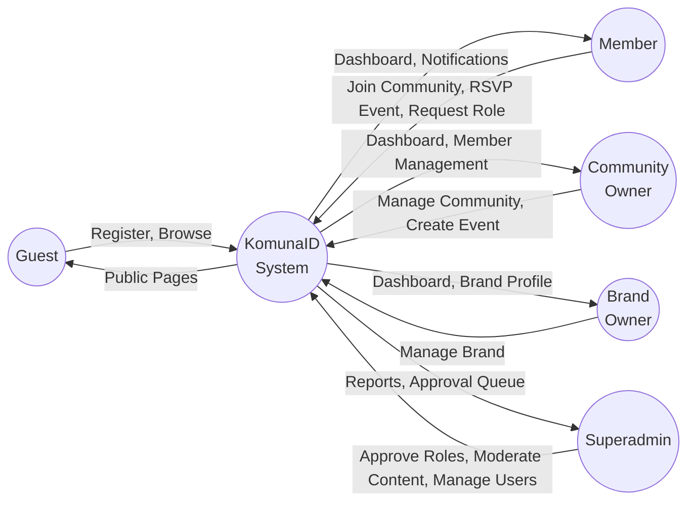

---

## DFD Level 1

### Proses Utama

| Proses | ID | Deskripsi |
|--------|----|-----------|
| Register / Login | P1 | Registrasi akun baru dan autentikasi pengguna |
| Role Request | P2 | Member mengajukan upgrade role ke Community Owner atau Brand Owner |
| Community Approval | P3 | Superadmin menyetujui atau menolak komunitas |
| Brand Approval | P4 | Superadmin menyetujui atau menolak brand |
| Join Community | P5 | Member bergabung dengan komunitas, approval oleh Community Owner |
| Create Event | P6 | Community Owner membuat dan mengelola event |
| Register Event | P7 | Member mendaftar (RSVP) ke event |
| Collaboration Request | P8 | Brand mengajukan kolaborasi dengan komunitas (Fase 2) |
| Manual Payment | P9 | Pembayaran manual untuk event berbayar (Fase 2) |
| Dashboard Reporting | P10 | Menampilkan data dan statistik di dashboard per role |

---

### DFD Level 1 — Register / Login (P1)

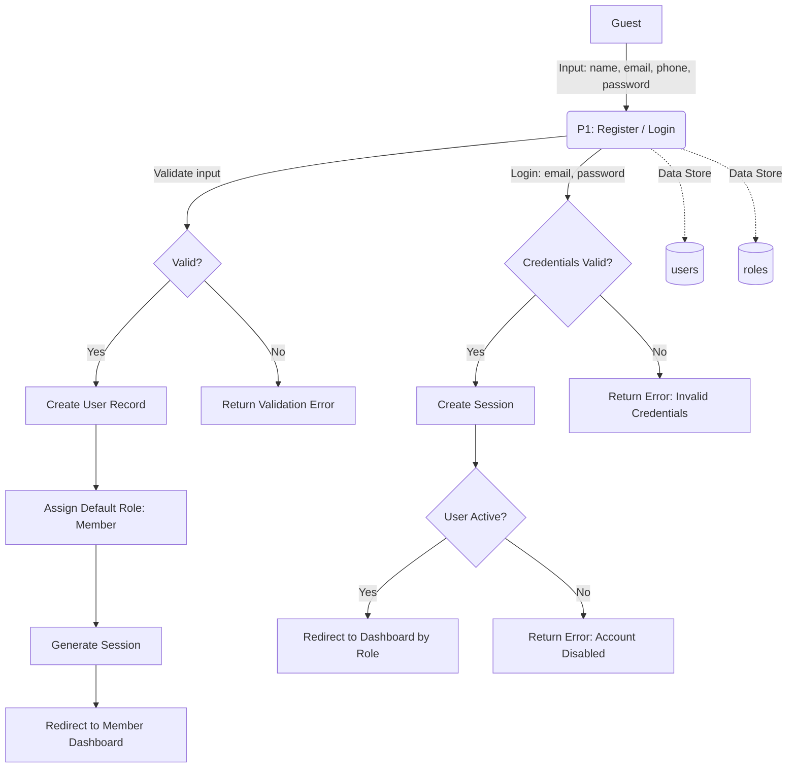

---

### DFD Level 1 — Role Request (P2)

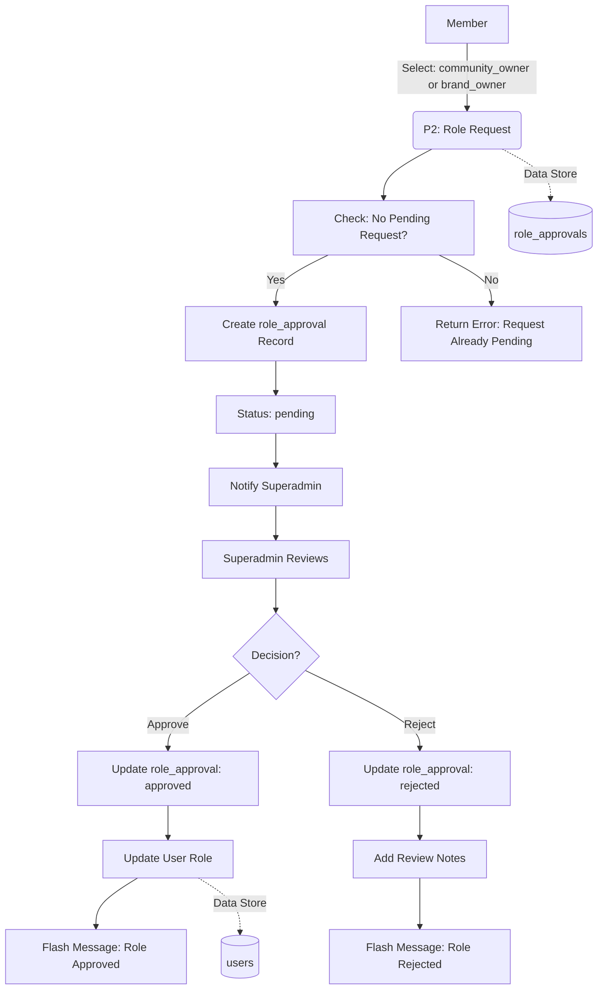

---

### DFD Level 1 — Community Approval (P3)

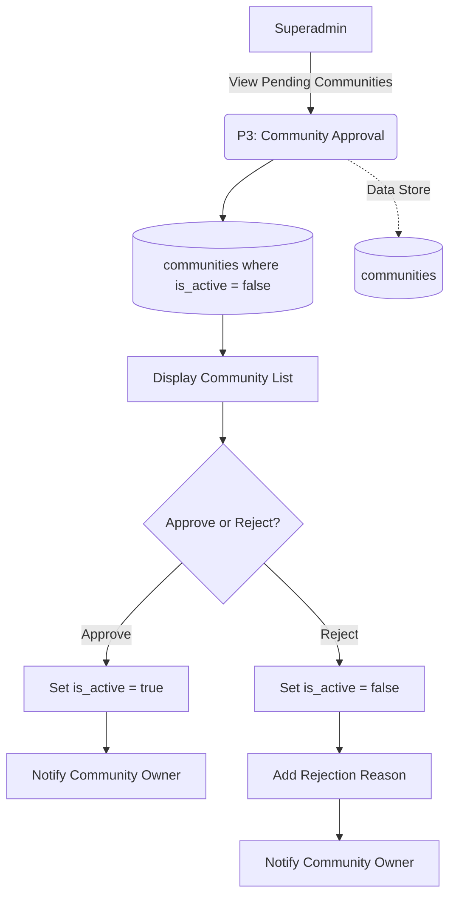

---

### DFD Level 1 — Brand Approval (P4)

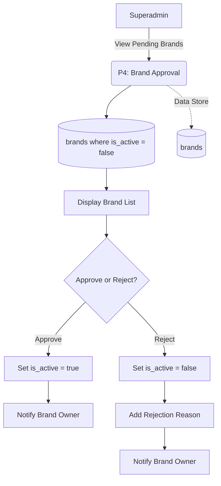

---

### DFD Level 1 — Join Community (P5)

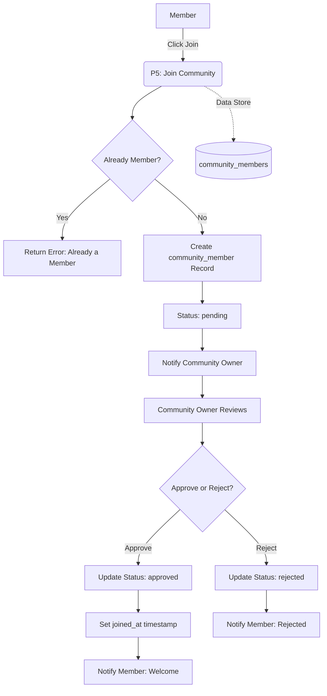

---

### DFD Level 1 — Create Event (P6)

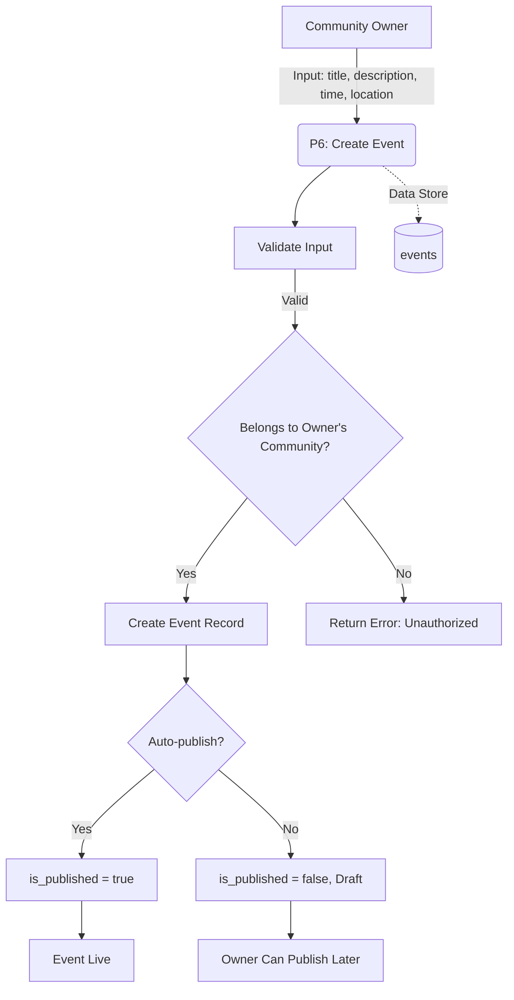

---

### DFD Level 1 — Register Event (P7)

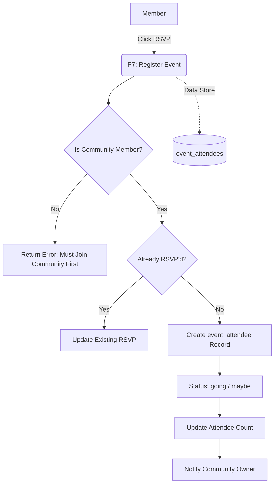

---

### DFD Level 1 — Collaboration Request (P8)

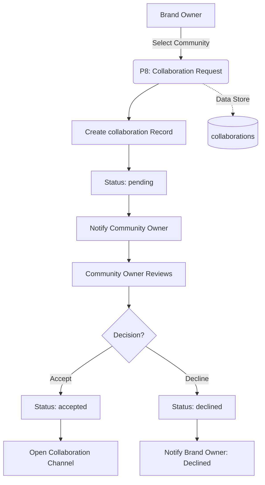

---

### DFD Level 1 — Manual Payment (P9)

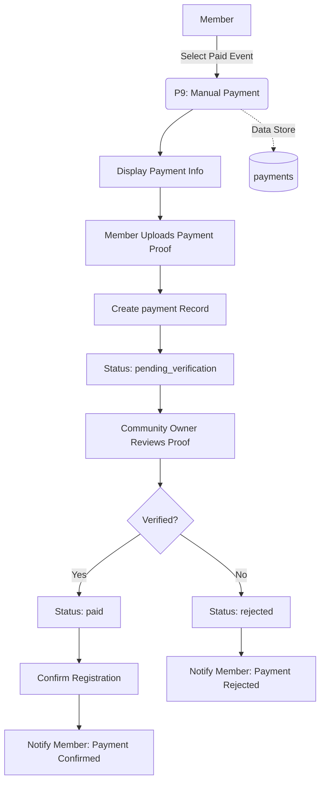

---

### DFD Level 1 — Dashboard Reporting (P10)

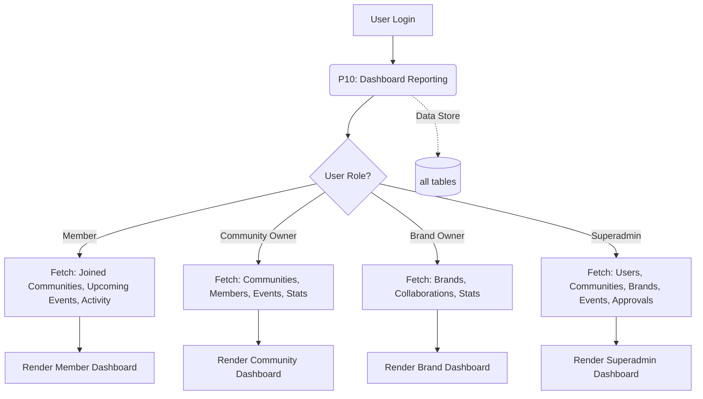

---

## DFD Summary Table

| ID | Process | Input | Output | Data Store |
|----|---------|-------|--------|------------|
| P1 | Register / Login | Guest credentials | Auth session | users, roles |
| P2 | Role Request | Role type, notes | Approval status | role_approvals, users |
| P3 | Community Approval | Community ID | Active status | communities |
| P4 | Brand Approval | Brand ID | Active status | brands |
| P5 | Join Community | Community ID | Membership status | community_members |
| P6 | Create Event | Event data | Published event | events |
| P7 | Register Event | Event ID, RSVP type | Attendance record | event_attendees |
| P8 | Collaboration Request | Brand + Community | Collaboration status | collaborations |
| P9 | Manual Payment | Payment proof | Payment status | payments |
| P10 | Dashboard Reporting | User role | Dashboard data | all tables |
