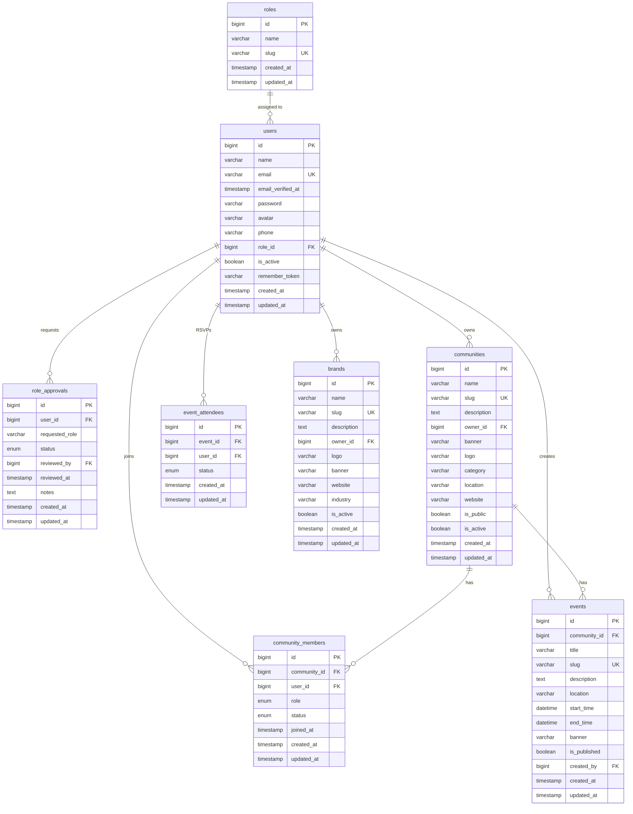

# KomunaID — Database Design

## Overview

Database KomunaID dirancang menggunakan **MySQL 8** / **MariaDB 10.x** (via XAMPP) dengan pendekatan relational schema. Semua tabel menggunakan `BIGINT UNSIGNED` untuk primary key dan `TIMESTAMP` untuk auditing.

---

## Entity Relationship Diagram



---

## Table Definitions

### 1. `roles`

| Column | Type | Constraint | Description |
|--------|------|-----------|-------------|
| `id` | `BIGINT UNSIGNED` | PK, AUTO_INCREMENT | Role ID |
| `name` | `VARCHAR(255)` | NOT NULL | Role display name |
| `slug` | `VARCHAR(255)` | UNIQUE, NOT NULL | Role slug identifier |
| `created_at` | `TIMESTAMP` | NULLABLE | Created timestamp |
| `updated_at` | `TIMESTAMP` | NULLABLE | Updated timestamp |

**Seed Data:**

| id | name | slug |
|----|------|------|
| 1 | Member | member |
| 2 | Community Owner | community_owner |
| 3 | Brand Owner | brand_owner |
| 4 | Superadmin | superadmin |

---

### 2. `users`

| Column | Type | Constraint | Description |
|--------|------|-----------|-------------|
| `id` | `BIGINT UNSIGNED` | PK, AUTO_INCREMENT | User ID |
| `name` | `VARCHAR(255)` | NOT NULL | Full name |
| `email` | `VARCHAR(255)` | UNIQUE, NOT NULL | Email address |
| `email_verified_at` | `TIMESTAMP` | NULLABLE | Email verification timestamp |
| `password` | `VARCHAR(255)` | NOT NULL | Hashed password |
| `avatar` | `VARCHAR(255)` | NULLABLE | Avatar file path |
| `phone` | `VARCHAR(20)` | NULLABLE | Phone number |
| `role_id` | `BIGINT UNSIGNED` | FK → roles.id, DEFAULT 1 | Current role |
| `is_active` | `BOOLEAN` | DEFAULT true | Account active status |
| `remember_token` | `VARCHAR(100)` | NULLABLE | Remember me token |
| `created_at` | `TIMESTAMP` | NULLABLE | Created timestamp |
| `updated_at` | `TIMESTAMP` | NULLABLE | Updated timestamp |

**Indexes:**
- `idx_users_email` (UNIQUE on `email`)
- `idx_users_role_id` (on `role_id`)

---

### 3. `role_approvals`

| Column | Type | Constraint | Description |
|--------|------|-----------|-------------|
| `id` | `BIGINT UNSIGNED` | PK, AUTO_INCREMENT | Approval ID |
| `user_id` | `BIGINT UNSIGNED` | FK → users.id, ON DELETE CASCADE | Requesting user |
| `requested_role` | `VARCHAR(255)` | NOT NULL | Requested role slug |
| `status` | `ENUM('pending','approved','rejected')` | DEFAULT 'pending' | Approval status |
| `reviewed_by` | `BIGINT UNSIGNED` | FK → users.id, NULLABLE | Superadmin who reviewed |
| `reviewed_at` | `TIMESTAMP` | NULLABLE | Review timestamp |
| `notes` | `TEXT` | NULLABLE | Review notes / user motivation |
| `created_at` | `TIMESTAMP` | NULLABLE | Created timestamp |
| `updated_at` | `TIMESTAMP` | NULLABLE | Updated timestamp |

**Indexes:**
- `idx_role_approvals_user_id` (on `user_id`)
- `idx_role_approvals_status` (on `status`)

---

### 4. `communities`

| Column | Type | Constraint | Description |
|--------|------|-----------|-------------|
| `id` | `BIGINT UNSIGNED` | PK, AUTO_INCREMENT | Community ID |
| `name` | `VARCHAR(255)` | NOT NULL | Community name |
| `slug` | `VARCHAR(255)` | UNIQUE, NOT NULL | URL slug |
| `description` | `TEXT` | NULLABLE | Community description |
| `owner_id` | `BIGINT UNSIGNED` | FK → users.id | Community owner |
| `banner` | `VARCHAR(255)` | NULLABLE | Banner image path |
| `logo` | `VARCHAR(255)` | NULLABLE | Logo image path |
| `category` | `VARCHAR(100)` | NULLABLE | Category tag |
| `location` | `VARCHAR(255)` | NULLABLE | Location |
| `website` | `VARCHAR(255)` | NULLABLE | Website URL |
| `is_public` | `BOOLEAN` | DEFAULT true | Public visibility |
| `is_active` | `BOOLEAN` | DEFAULT true | Active/approved status |
| `created_at` | `TIMESTAMP` | NULLABLE | Created timestamp |
| `updated_at` | `TIMESTAMP` | NULLABLE | Updated timestamp |

**Indexes:**
- `idx_communities_slug` (UNIQUE on `slug`)
- `idx_communities_owner_id` (on `owner_id`)
- `idx_communities_category` (on `category`)
- `idx_communities_is_active` (on `is_active`)

---

### 5. `community_members`

| Column | Type | Constraint | Description |
|--------|------|-----------|-------------|
| `id` | `BIGINT UNSIGNED` | PK, AUTO_INCREMENT | Membership ID |
| `community_id` | `BIGINT UNSIGNED` | FK → communities.id, ON DELETE CASCADE | Community |
| `user_id` | `BIGINT UNSIGNED` | FK → users.id, ON DELETE CASCADE | Member |
| `role` | `ENUM('owner','admin','member')` | DEFAULT 'member' | Role in community |
| `status` | `ENUM('pending','approved','rejected')` | DEFAULT 'pending' | Membership status |
| `joined_at` | `TIMESTAMP` | NULLABLE | Approval timestamp |
| `created_at` | `TIMESTAMP` | NULLABLE | Created timestamp |
| `updated_at` | `TIMESTAMP` | NULLABLE | Updated timestamp |

**Constraints:**
- `UNIQUE(community_id, user_id)` — one membership per user per community

**Indexes:**
- `idx_community_members_community_id` (on `community_id`)
- `idx_community_members_user_id` (on `user_id`)
- `idx_community_members_status` (on `status`)

---

### 6. `events`

| Column | Type | Constraint | Description |
|--------|------|-----------|-------------|
| `id` | `BIGINT UNSIGNED` | PK, AUTO_INCREMENT | Event ID |
| `community_id` | `BIGINT UNSIGNED` | FK → communities.id, ON DELETE CASCADE | Parent community |
| `title` | `VARCHAR(255)` | NOT NULL | Event title |
| `slug` | `VARCHAR(255)` | UNIQUE, NOT NULL | URL slug |
| `description` | `TEXT` | NULLABLE | Event description |
| `location` | `VARCHAR(255)` | NULLABLE | Event location |
| `start_time` | `DATETIME` | NOT NULL | Event start |
| `end_time` | `DATETIME` | NULLABLE | Event end |
| `banner` | `VARCHAR(255)` | NULLABLE | Banner image path |
| `is_published` | `BOOLEAN` | DEFAULT false | Published status |
| `created_by` | `BIGINT UNSIGNED` | FK → users.id | Creator (community owner) |
| `created_at` | `TIMESTAMP` | NULLABLE | Created timestamp |
| `updated_at` | `TIMESTAMP` | NULLABLE | Updated timestamp |

**Indexes:**
- `idx_events_slug` (UNIQUE on `slug`)
- `idx_events_community_id` (on `community_id`)
- `idx_events_created_by` (on `created_by`)
- `idx_events_start_time` (on `start_time`)

---

### 7. `event_attendees`

| Column | Type | Constraint | Description |
|--------|------|-----------|-------------|
| `id` | `BIGINT UNSIGNED` | PK, AUTO_INCREMENT | RSVP ID |
| `event_id` | `BIGINT UNSIGNED` | FK → events.id, ON DELETE CASCADE | Event |
| `user_id` | `BIGINT UNSIGNED` | FK → users.id, ON DELETE CASCADE | Attendee |
| `status` | `ENUM('going','maybe','not_going')` | DEFAULT 'going' | RSVP status |
| `created_at` | `TIMESTAMP` | NULLABLE | Created timestamp |
| `updated_at` | `TIMESTAMP` | NULLABLE | Updated timestamp |

**Constraints:**
- `UNIQUE(event_id, user_id)` — one RSVP per user per event

**Indexes:**
- `idx_event_attendees_event_id` (on `event_id`)
- `idx_event_attendees_user_id` (on `user_id`)

---

### 8. `brands`

| Column | Type | Constraint | Description |
|--------|------|-----------|-------------|
| `id` | `BIGINT UNSIGNED` | PK, AUTO_INCREMENT | Brand ID |
| `name` | `VARCHAR(255)` | NOT NULL | Brand name |
| `slug` | `VARCHAR(255)` | UNIQUE, NOT NULL | URL slug |
| `description` | `TEXT` | NULLABLE | Brand description |
| `owner_id` | `BIGINT UNSIGNED` | FK → users.id | Brand owner |
| `logo` | `VARCHAR(255)` | NULLABLE | Logo image path |
| `banner` | `VARCHAR(255)` | NULLABLE | Banner image path |
| `website` | `VARCHAR(255)` | NULLABLE | Website URL |
| `industry` | `VARCHAR(100)` | NULLABLE | Industry category |
| `is_active` | `BOOLEAN` | DEFAULT true | Active/approved status |
| `created_at` | `TIMESTAMP` | NULLABLE | Created timestamp |
| `updated_at` | `TIMESTAMP` | NULLABLE | Updated timestamp |

**Indexes:**
- `idx_brands_slug` (UNIQUE on `slug`)
- `idx_brands_owner_id` (on `owner_id`)
- `idx_brands_industry` (on `industry`)

---

## Relationships Summary

| Relationship | Type | FK Column | Cascade |
|-------------|------|-----------|---------|
| `roles` → `users` | One-to-Many | `users.role_id` | RESTRICT |
| `users` → `role_approvals` | One-to-Many | `role_approvals.user_id` | CASCADE |
| `users` → `communities` | One-to-Many | `communities.owner_id` | RESTRICT |
| `users` → `community_members` | One-to-Many | `community_members.user_id` | CASCADE |
| `users` → `events` | One-to-Many | `events.created_by` | RESTRICT |
| `users` → `event_attendees` | One-to-Many | `event_attendees.user_id` | CASCADE |
| `users` → `brands` | One-to-Many | `brands.owner_id` | RESTRICT |
| `communities` → `community_members` | One-to-Many | `community_members.community_id` | CASCADE |
| `communities` → `events` | One-to-Many | `events.community_id` | CASCADE |
| `events` → `event_attendees` | One-to-Many | `event_attendees.event_id` | CASCADE |

---

## Migration Order

Migrations harus dijalankan dalam urutan berikut untuk memenuhi foreign key constraints:

```
1. roles
2. users (depends on: roles)
3. role_approvals (depends on: users)
4. communities (depends on: users)
5. community_members (depends on: communities, users)
6. events (depends on: communities, users)
7. event_attendees (depends on: events, users)
8. brands (depends on: users)
```

---

## File Storage Strategy

| Entity | Storage Path | Access |
|--------|-------------|--------|
| User Avatar | `storage/app/public/avatars/{user_id}_{hash}.{ext}` | Public via symlink |
| Community Banner | `storage/app/public/banners/community_{id}_{hash}.{ext}` | Public via symlink |
| Community Logo | `storage/app/public/logos/community_{id}_{hash}.{ext}` | Public via symlink |
| Event Banner | `storage/app/public/banners/event_{id}_{hash}.{ext}` | Public via symlink |
| Brand Logo | `storage/app/public/logos/brand_{id}_{hash}.{ext}` | Public via symlink |
| Brand Banner | `storage/app/public/banners/brand_{id}_{hash}.{ext}` | Public via symlink |

### Laravel Storage Configuration

```php
// .env
FILESYSTEM_DISK=local
```

```bash
# Create symlink for public access
php artisan storage:link
# Creates: public/storage → storage/app/public
```

---

## Seeder Configuration

### DatabaseSeeder.php

```php
public function run(): void
{
    $this->call([
        RoleSeeder::class,
        SuperadminSeeder::class,
    ]);
}
```

### RoleSeeder.php

```php
public function run(): void
{
    $roles = [
        ['name' => 'Member', 'slug' => 'member'],
        ['name' => 'Community Owner', 'slug' => 'community_owner'],
        ['name' => 'Brand Owner', 'slug' => 'brand_owner'],
        ['name' => 'Superadmin', 'slug' => 'superadmin'],
    ];

    foreach ($roles as $role) {
        Role::create($role);
    }
}
```

### SuperadminSeeder.php

```php
public function run(): void
{
    User::create([
        'name' => 'Superadmin',
        'email' => 'admin@komunaid.com',
        'password' => Hash::make('password'),
        'role_id' => Role::where('slug', 'superadmin')->first()->id,
        'email_verified_at' => now(),
    ]);
}
```
