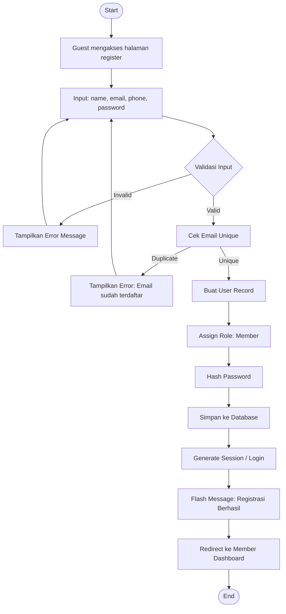
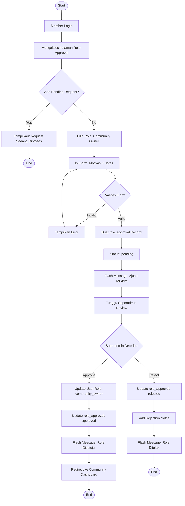
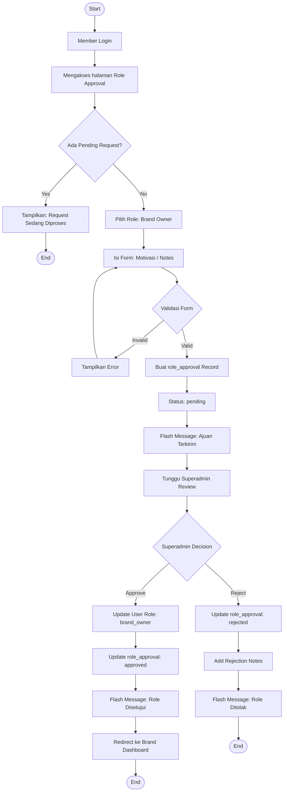
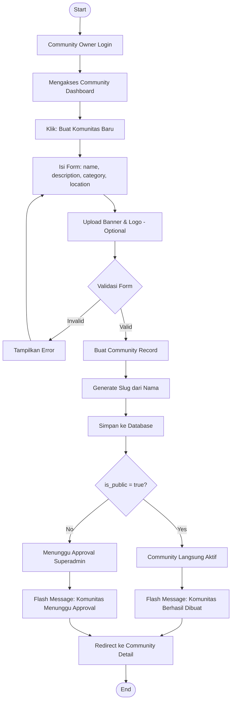
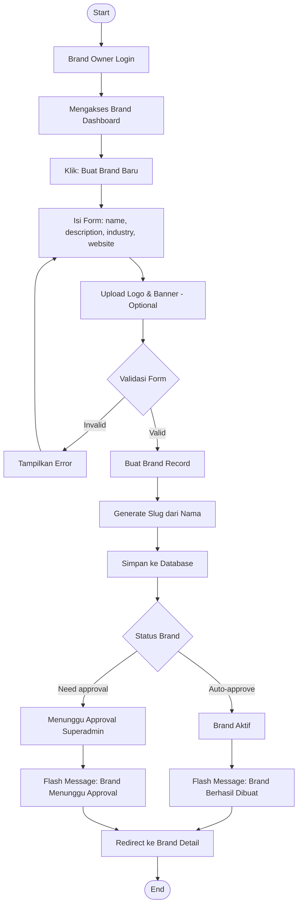
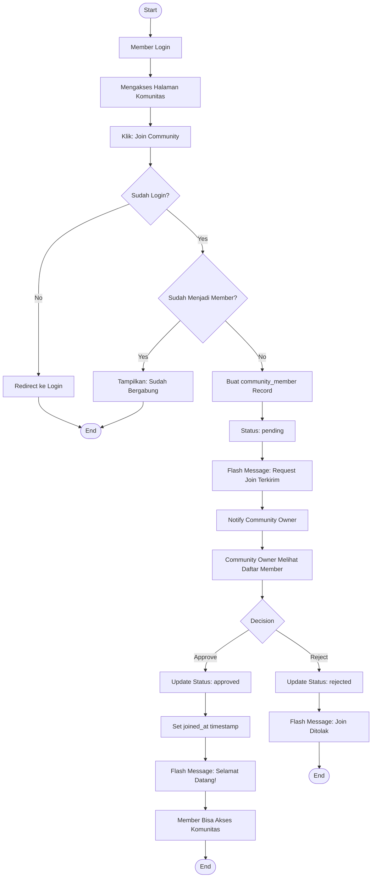
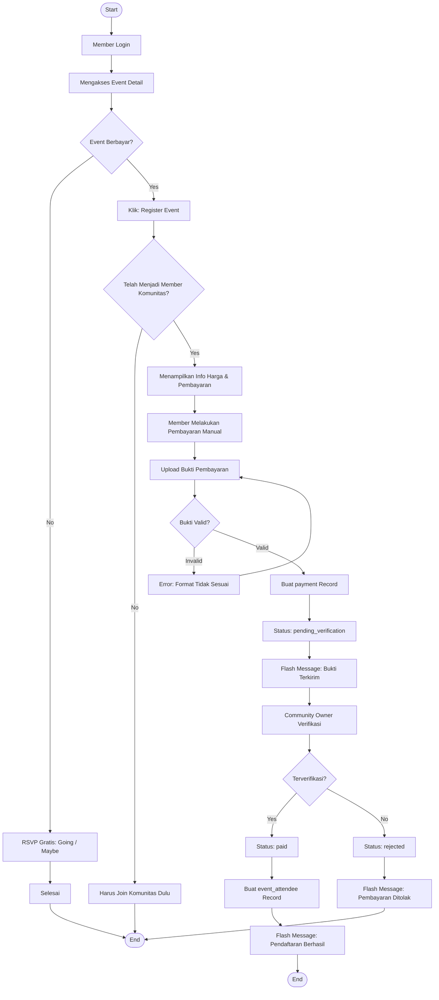
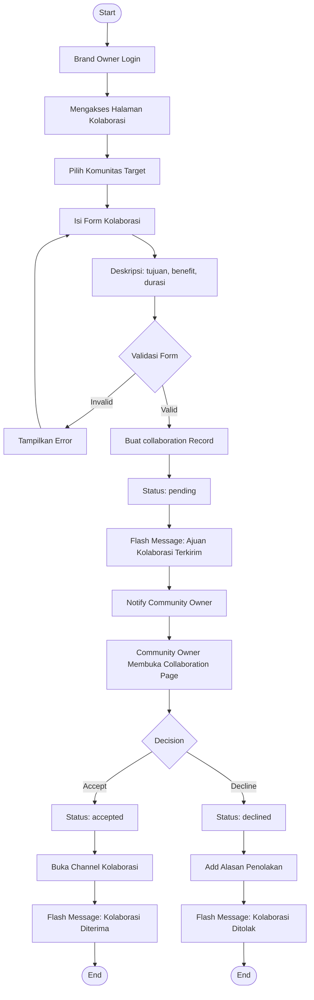
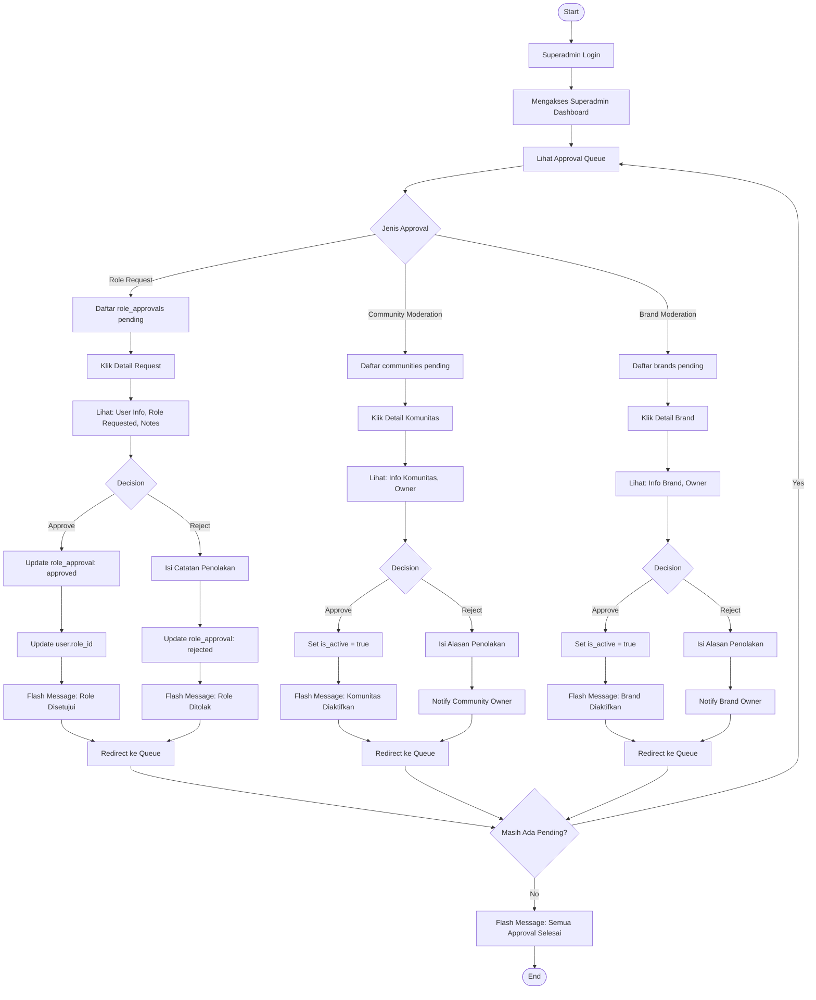

# KomunaID — Flowchart

## 1. Register sebagai Member

---

## 2. Ajukan Community Owner

---

## 3. Ajukan Brand Owner

---

## 4. Community Owner Membuat Komunitas

---

## 5. Brand Owner Membuat Brand

---

## 6. Member Join Community

---

## 7. Member Register Event Paid

---

## 8. Brand Mengajukan Kolaborasi

---

## 9. Superadmin Approval

