# KomunaID — Entity Relationship Diagram

## Overview

Database KomunaID dirancang menggunakan **MySQL 8** / **MariaDB 10.x** dengan pendekatan relational schema. Semua tabel menggunakan `BIGINT UNSIGNED` untuk primary key, `TIMESTAMP` untuk auditing, dan `soft deletes` untuk data penting.

---

## ER Diagram (Mermaid)

```mermaid
erDiagram
    users ||--o{ profiles : "has"
    users ||--o{ role_requests : "requests"
    users ||--o{ community_members : "joins"
    users ||--o{ brand_members : "joins"
    users ||--o{ events : "creates"
    users ||--o{ event_registrations : "RSVPs"
    users ||--o{ collaboration_requests : "initiates"
    users ||--o{ donations : "donates"
    users ||--o{ wallets : "has"
    users ||--o{ notifications : "receives"
    users ||--o{ approval_logs : "reviews"

    roles ||--o{ users : "assigned to"
    roles ||--o{ role_requests : "requested as"

    community_categories ||--o{ communities : "classifies"

    communities ||--o{ community_members : "has"
    communities ||--o{ community_regions : "located in"
    communities ||--o{ community_subgroups : "has"
    communities ||--o{ events : "hosts"
    communities ||--o{ collaboration_requests : "receives"
    communities ||--o{ campaigns : "runs"
    communities ||--o{ donations : "receives"
    communities ||--o{ community_chats : "has"

    community_subgroups ||--o{ community_members : "contains"
    community_subgroups ||--o{ community_chat_threads : "has"

    brands ||--o{ brand_members : "has"
    brands ||--o{ collaboration_requests : "initiates"
    brands ||--o{ campaigns : "sponsors"

    events ||--o{ event_registrations : "has"
    events ||--o{ event_galleries : "has"
    events ||--o{ event_chats : "has"
    events ||--o{ event_chat_threads : "has"

    wallets ||--o{ wallet_transactions : "records"

    campaign_donations }o--|| campaigns : "part of"
    donations }o--|| wallets : "credits"
    donations }o--o{ campaign_donations : "links to"
    donations }o--o{ platform_fees : "generates"

    audit_logs }o--o{ approval_logs : "tracks"

    users {
        bigint id PK
        varchar name
        varchar email UK
        timestamp email_verified_at
        varchar password
        varchar avatar
        varchar phone
        bigint role_id FK
        boolean is_active
        timestamp deleted_at
        varchar remember_token
        timestamp created_at
        timestamp updated_at
    }

    profiles {
        bigint id PK
        bigint user_id FK
        text bio
        varchar address
        varchar city
        varchar province
        varchar country
        varchar website
        varchar social_instagram
        varchar social_twitter
        varchar social_facebook
        timestamp created_at
        timestamp updated_at
    }

    roles {
        bigint id PK
        varchar name
        varchar slug UK
        timestamp created_at
        timestamp updated_at
    }

    role_requests {
        bigint id PK
        bigint user_id FK
        bigint role_id FK
        varchar motivation
        text supporting_documents
        enum status
        bigint reviewed_by FK
        timestamp reviewed_at
        text review_notes
        timestamp created_at
        timestamp updated_at
    }

    community_categories {
        bigint id PK
        varchar name UK
        varchar slug UK
        varchar icon
        varchar description
        int sort_order
        boolean is_active
        timestamp created_at
        timestamp updated_at
    }

    communities {
        bigint id PK
        varchar name
        varchar slug UK
        text description
        bigint owner_id FK
        bigint category_id FK
        varchar banner
        varchar logo
        varchar location
        varchar website
        boolean is_public
        boolean is_active
        enum status
        timestamp approved_at
        bigint approved_by FK
        timestamp deleted_at
        timestamp created_at
        timestamp updated_at
    }

    community_members {
        bigint id PK
        bigint community_id FK
        bigint user_id FK
        bigint subgroup_id FK
        enum role
        enum status
        timestamp joined_at
        timestamp deleted_at
        timestamp created_at
        timestamp updated_at
    }

    community_regions {
        bigint id PK
        bigint community_id FK
        varchar province
        varchar city
        varchar district
        varchar address
        decimal latitude
        decimal longitude
        boolean is_primary
        timestamp created_at
        timestamp updated_at
    }

    community_subgroups {
        bigint id PK
        bigint community_id FK
        varchar name
        varchar description
        enum type
        boolean is_active
        timestamp created_at
        timestamp updated_at
    }

    brands {
        bigint id PK
        varchar name
        varchar slug UK
        text description
        bigint owner_id FK
        varchar logo
        varchar banner
        varchar website
        varchar industry
        boolean is_active
        enum status
        timestamp approved_at
        bigint approved_by FK
        timestamp deleted_at
        timestamp created_at
        timestamp updated_at
    }

    brand_members {
        bigint id PK
        bigint brand_id FK
        bigint user_id FK
        enum role
        enum status
        timestamp joined_at
        timestamp created_at
        timestamp updated_at
    }

    events {
        bigint id PK
        bigint community_id FK
        varchar title
        varchar slug UK
        text description
        varchar location
        datetime start_time
        datetime end_time
        varchar banner
        enum status
        boolean is_published
        decimal ticket_price
        int max_attendees
        bigint created_by FK
        timestamp deleted_at
        timestamp created_at
        timestamp updated_at
    }

    event_registrations {
        bigint id PK
        bigint event_id FK
        bigint user_id FK
        enum status
        varchar payment_method
        enum payment_status
        decimal amount_paid
        timestamp registered_at
        timestamp checked_in_at
        timestamp created_at
        timestamp updated_at
    }

    event_galleries {
        bigint id PK
        bigint event_id FK
        bigint uploaded_by FK
        varchar file_path
        varchar file_type
        varchar caption
        int sort_order
        timestamp created_at
        timestamp updated_at
    }

    event_chats {
        bigint id PK
        bigint event_id FK
        bigint user_id FK
        text message
        varchar attachment
        timestamp created_at
        timestamp updated_at
    }

    event_chat_threads {
        bigint id PK
        bigint event_chat_id FK
        bigint user_id FK
        text message
        varchar attachment
        timestamp created_at
        timestamp updated_at
    }

    community_chats {
        bigint id PK
        bigint community_id FK
        bigint user_id FK
        text message
        varchar attachment
        timestamp created_at
        timestamp updated_at
    }

    community_chat_threads {
        bigint id PK
        bigint community_chat_id FK
        bigint user_id FK
        text message
        varchar attachment
        timestamp created_at
        timestamp updated_at
    }

    collaboration_requests {
        bigint id PK
        bigint brand_id FK
        bigint community_id FK
        bigint initiated_by FK
        varchar title
        text description
        enum type
        enum status
        decimal budget
        datetime proposed_start_date
        datetime proposed_end_date
        text terms
        bigint reviewed_by FK
        timestamp reviewed_at
        text review_notes
        timestamp deleted_at
        timestamp created_at
        timestamp updated_at
    }

    campaigns {
        bigint id PK
        bigint community_id FK
        bigint brand_id FK
        varchar name
        varchar slug UK
        text description
        varchar banner
        decimal target_amount
        decimal current_amount
        datetime start_date
        datetime end_date
        enum status
        timestamp deleted_at
        timestamp created_at
        timestamp updated_at
    }

    donations {
        bigint id PK
        bigint user_id FK
        bigint community_id FK
        bigint campaign_id FK
        bigint wallet_id FK
        decimal amount
        varchar payment_method
        enum payment_status
        text notes
        varchar proof_image
        timestamp donated_at
        timestamp created_at
        timestamp updated_at
    }

    wallets {
        bigint id PK
        bigint user_id FK
        decimal balance
        enum status
        timestamp created_at
        timestamp updated_at
    }

    wallet_transactions {
        bigint id PK
        bigint wallet_id FK
        enum type
        decimal amount
        decimal balance_before
        decimal balance_after
        varchar reference_type
        bigint reference_id
        text description
        enum status
        timestamp created_at
        timestamp updated_at
    }

    notifications {
        bigint id PK
        bigint user_id FK
        varchar type
        varchar title
        text message
        varchar data
        boolean is_read
        timestamp read_at
        timestamp created_at
        timestamp updated_at
    }

    approval_logs {
        bigint id PK
        varchar loggable_type
        bigint loggable_id
        bigint user_id FK
        enum action
        text reason
        text old_values
        text new_values
        timestamp created_at
        timestamp updated_at
    }

    audit_logs {
        bigint id PK
        bigint user_id FK
        varchar auditable_type
        bigint auditable_id
        enum event
        text old_values
        text new_values
        varchar ip_address
        varchar user_agent
        timestamp created_at
        timestamp updated_at
    }

    platform_fees {
        bigint id PK
        bigint donation_id FK
        decimal percentage
        decimal amount
        decimal net_amount
        enum status
        timestamp created_at
        timestamp updated_at
    }
```

---

## Relationships Summary

### Core User Relations

| Relationship | Type | FK Column | Cascade |
|-------------|------|-----------|---------|
| `roles` → `users` | One-to-Many | `users.role_id` | RESTRICT |
| `users` → `profiles` | One-to-One | `profiles.user_id` | CASCADE |
| `users` → `role_requests` | One-to-Many | `role_requests.user_id` | CASCADE |
| `users` → `wallets` | One-to-One | `wallets.user_id` | CASCADE |

### Community Relations

| Relationship | Type | FK Column | Cascade |
|-------------|------|-----------|---------|
| `community_categories` → `communities` | One-to-Many | `communities.category_id` | RESTRICT |
| `users` → `communities` | One-to-Many | `communities.owner_id` | RESTRICT |
| `communities` → `community_members` | One-to-Many | `community_members.community_id` | CASCADE |
| `communities` → `community_regions` | One-to-Many | `community_regions.community_id` | CASCADE |
| `communities` → `community_subgroups` | One-to-Many | `community_subgroups.community_id` | CASCADE |
| `community_subgroups` → `community_members` | One-to-Many | `community_members.subgroup_id` | SET NULL |

### Event Relations

| Relationship | Type | FK Column | Cascade |
|-------------|------|-----------|---------|
| `communities` → `events` | One-to-Many | `events.community_id` | CASCADE |
| `events` → `event_registrations` | One-to-Many | `event_registrations.event_id` | CASCADE |
| `events` → `event_galleries` | One-to-Many | `event_galleries.event_id` | CASCADE |
| `events` → `event_chats` | One-to-Many | `event_chats.event_id` | CASCADE |
| `event_chats` → `event_chat_threads` | One-to-Many | `event_chat_threads.event_chat_id` | CASCADE |

### Brand Relations

| Relationship | Type | FK Column | Cascade |
|-------------|------|-----------|---------|
| `users` → `brands` | One-to-Many | `brands.owner_id` | RESTRICT |
| `brands` → `brand_members` | One-to-Many | `brand_members.brand_id` | CASCADE |
| `brands` → `collaboration_requests` | One-to-Many | `collaboration_requests.brand_id` | CASCADE |
| `brands` → `campaigns` | One-to-Many | `campaigns.brand_id` | RESTRICT |

### Financial Relations

| Relationship | Type | FK Column | Cascade |
|-------------|------|-----------|---------|
| `wallets` → `wallet_transactions` | One-to-Many | `wallet_transactions.wallet_id` | CASCADE |
| `users` → `donations` | One-to-Many | `donations.user_id` | RESTRICT |
| `campaigns` → `donations` | One-to-Many | `donations.campaign_id` | SET NULL |
| `donations` → `platform_fees` | One-to-One | `platform_fees.donation_id` | CASCADE |

### Audit Relations

| Relationship | Type | FK Column | Cascade |
|-------------|------|-----------|---------|
| `users` → `notifications` | One-to-Many | `notifications.user_id` | CASCADE |
| `users` → `approval_logs` | One-to-Many | `approval_logs.user_id` | RESTRICT |
| `users` → `audit_logs` | One-to-Many | `audit_logs.user_id` | RESTRICT |

---

## Polymorphic Relationships

Beberapa tabel menggunakan polymorphic relationships untuk fleksibilitas:

| Table | Column | References |
|-------|--------|------------|
| `approval_logs` | `loggable_type` + `loggable_id` | `communities`, `brands`, `events`, `collaboration_requests` |
| `wallet_transactions` | `reference_type` + `reference_id` | `donations`, `event_registrations`, `campaigns` |
| `audit_logs` | `auditable_type` + `auditable_id` | Semua model utama |

---

## Soft Delete Tables

Tabel berikut menggunakan `deleted_at` untuk soft delete:

| Table | Reason |
|-------|--------|
| `users` | Data user penting, tidak dihapus permanen |
| `communities` | Data komunitas bersejarah |
| `community_members` | Riwayat keanggotaan |
| `brands` | Data brand bersejarah |
| `events` | Riwayat event |
| `collaboration_requests` | Riwayat kolaborasi |
| `campaigns` | Riwayat kampanye |

---

## Index Strategy

### Primary Indexes (otomatis)
- Semua tabel memiliki `id` BIGINT UNSIGNED AUTO_INCREMENT sebagai PK

### Unique Indexes
- `users.email`
- `roles.slug`
- `community_categories.name`, `community_categories.slug`
- `communities.slug`
- `brands.slug`
- `events.slug`
- `campaigns.slug`
- `community_members(community_id, user_id)` — composite unique
- `brand_members(brand_id, user_id)` — composite unique
- `event_registrations(event_id, user_id)` — composite unique

### Performance Indexes
- `users.role_id`
- `users.is_active`
- `communities.owner_id`
- `communities.category_id`
- `communities.status`
- `communities.is_active`
- `community_members.community_id`
- `community_members.user_id`
- `community_members.status`
- `events.community_id`
- `events.created_by`
- `events.start_time`
- `events.status`
- `brands.owner_id`
- `brands.industry`
- `brands.status`
- `event_registrations.event_id`
- `event_registrations.user_id`
- `event_registrations.status`
- `wallets.user_id`
- `wallet_transactions.wallet_id`
- `wallet_transactions.type`
- `notifications.user_id`
- `notifications.is_read`
- `approval_logs.user_id`
- `approval_logs.loggable_type`, `approval_logs.loggable_id`
- `audit_logs.user_id`
- `audit_logs.auditable_type`, `audit_logs.auditable_id`
- `audit_logs.event`
- `donations.user_id`
- `donations.community_id`
- `donations.campaign_id`
- `donations.payment_status`
- `campaigns.community_id`
- `campaigns.brand_id`
- `campaigns.status`
- `collaboration_requests.brand_id`
- `collaboration_requests.community_id`
- `collaboration_requests.status`
- `platform_fees.donation_id`
