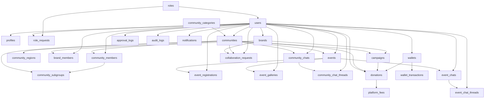

# KomunaID — Migration Plan

## Overview

Migration plan ini mendeskripsikan urutan pembuatan migration Laravel yang aman, foreign key dependency, index strategy, dan rekomendasi seeder untuk database KomunaID.

---

## Migration Order

Migrations harus dijalankan dalam urutan berikut untuk memenuhi foreign key constraints. Urutan ini disusun berdasarkan dependency antar tabel.

### Phase 1: Foundation Tables

```
1.  roles                    → Independent (no FK dependencies)
2.  users                    → Depends on: roles
3.  profiles                 → Depends on: users
4.  community_categories     → Independent (no FK dependencies)
```

### Phase 2: Community Structure

```
5.  communities              → Depends on: users, community_categories
6.  community_members        → Depends on: communities, users
7.  community_subgroups      → Depends on: communities
8.  community_regions        → Depends on: communities
```

### Phase 3: Brand Structure

```
9.  brands                   → Depends on: users
10. brand_members            → Depends on: brands, users
```

### Phase 4: Event Structure

```
11. events                   → Depends on: communities, users
12. event_registrations      → Depends on: events, users
13. event_galleries          → Depends on: events, users
```

### Phase 5: Chat System

```
14. community_chats          → Depends on: communities, users
15. community_chat_threads   → Depends on: community_chats, users
16. event_chats              → Depends on: events, users
17. event_chat_threads       → Depends on: event_chats, users
```

### Phase 6: Collaboration & Campaigns

```
18. collaboration_requests   → Depends on: brands, communities, users
19. campaigns                → Depends on: communities, brands
```

### Phase 7: Financial System

```
20. wallets                  → Depends on: users
21. wallet_transactions      → Depends on: wallets
22. donations                → Depends on: users, communities, campaigns, wallets
23. platform_fees            → Depends on: donations
```

### Phase 8: Role Requests & Audit

```
24. role_requests            → Depends on: users, roles, users (reviewer)
25. approval_logs            → Depends on: users
26. audit_logs               → Depends on: users
27. notifications            → Depends on: users
```

---

## Dependency Graph



---

## Laravel Migration Files

### 1. `0001_01_01_000000_create_users_table.php`

```php
<?php

use Illuminate\Database\Migrations\Migration;
use Illuminate\Database\Schema\Blueprint;
use Illuminate\Support\Facades\Schema;

return new class extends Migration
{
    public function up(): void
    {
        Schema::create('users', function (Blueprint $table) {
            $table->id();
            $table->string('name');
            $table->string('email')->unique();
            $table->timestamp('email_verified_at')->nullable();
            $table->string('password');
            $table->string('avatar')->nullable();
            $table->string('phone', 20)->nullable();
            $table->foreignId('role_id')->constrained()->default(1);
            $table->boolean('is_active')->default(true);
            $table->softDeletes();
            $table->rememberToken();
            $table->timestamps();

            $table->index('role_id');
            $table->index('is_active');
        });
    }

    public function down(): void
    {
        Schema::dropIfExists('users');
    }
};
```

### 2. `0001_01_01_000001_create_roles_table.php`

```php
<?php

use Illuminate\Database\Migrations\Migration;
use Illuminate\Database\Schema\Blueprint;
use Illuminate\Support\Facades\Schema;

return new class extends Migration
{
    public function up(): void
    {
        Schema::create('roles', function (Blueprint $table) {
            $table->id();
            $table->string('name');
            $table->string('slug')->unique();
            $table->timestamps();
        });
    }

    public function down(): void
    {
        Schema::dropIfExists('roles');
    }
};
```

### 3. `0001_01_01_000002_create_profiles_table.php`

```php
<?php

use Illuminate\Database\Migrations\Migration;
use Illuminate\Database\Schema\Blueprint;
use Illuminate\Support\Facades\Schema;

return new class extends Migration
{
    public function up(): void
    {
        Schema::create('profiles', function (Blueprint $table) {
            $table->id();
            $table->foreignId('user_id')->constrained()->cascadeOnDelete();
            $table->text('bio')->nullable();
            $table->string('address', 500)->nullable();
            $table->string('city', 100)->nullable();
            $table->string('province', 100)->nullable();
            $table->string('country', 100)->default('Indonesia');
            $table->string('website')->nullable();
            $table->string('social_instagram')->nullable();
            $table->string('social_twitter')->nullable();
            $table->string('social_facebook')->nullable();
            $table->timestamps();

            $table->unique('user_id');
        });
    }

    public function down(): void
    {
        Schema::dropIfExists('profiles');
    }
};
```

### 4. `0001_01_01_000003_create_community_categories_table.php`

```php
<?php

use Illuminate\Database\Migrations\Migration;
use Illuminate\Database\Schema\Blueprint;
use Illuminate\Support\Facades\Schema;

return new class extends Migration
{
    public function up(): void
    {
        Schema::create('community_categories', function (Blueprint $table) {
            $table->id();
            $table->string('name')->unique();
            $table->string('slug')->unique();
            $table->string('icon', 100)->nullable();
            $table->string('description', 500)->nullable();
            $table->integer('sort_order')->default(0);
            $table->boolean('is_active')->default(true);
            $table->timestamps();
        });
    }

    public function down(): void
    {
        Schema::dropIfExists('community_categories');
    }
};
```

### 5. `0001_01_01_000004_create_communities_table.php`

```php
<?php

use Illuminate\Database\Migrations\Migration;
use Illuminate\Database\Schema\Blueprint;
use Illuminate\Support\Facades\Schema;

return new class extends Migration
{
    public function up(): void
    {
        Schema::create('communities', function (Blueprint $table) {
            $table->id();
            $table->string('name');
            $table->string('slug')->unique();
            $table->text('description')->nullable();
            $table->foreignId('owner_id')->constrained('users')->restrictOnDelete();
            $table->foreignId('category_id')->nullable()->constrained('community_categories')->nullOnDelete();
            $table->string('banner')->nullable();
            $table->string('logo')->nullable();
            $table->string('location')->nullable();
            $table->string('website')->nullable();
            $table->boolean('is_public')->default(true);
            $table->boolean('is_active')->default(true);
            $table->enum('status', ['pending', 'approved', 'rejected', 'suspended'])->default('pending');
            $table->timestamp('approved_at')->nullable();
            $table->foreignId('approved_by')->nullable()->constrained('users')->nullOnDelete();
            $table->softDeletes();
            $table->timestamps();

            $table->index('owner_id');
            $table->index('category_id');
            $table->index('status');
            $table->index('is_active');
        });
    }

    public function down(): void
    {
        Schema::dropIfExists('communities');
    }
};
```

### 6. `0001_01_01_000005_create_community_members_table.php`

```php
<?php

use Illuminate\Database\Migrations\Migration;
use Illuminate\Database\Schema\Blueprint;
use Illuminate\Support\Facades\Schema;

return new class extends Migration
{
    public function up(): void
    {
        Schema::create('community_members', function (Blueprint $table) {
            $table->id();
            $table->foreignId('community_id')->constrained()->cascadeOnDelete();
            $table->foreignId('user_id')->constrained()->cascadeOnDelete();
            $table->foreignId('subgroup_id')->nullable()->constrained('community_subgroups')->nullOnDelete();
            $table->enum('role', ['owner', 'admin', 'member'])->default('member');
            $table->enum('status', ['pending', 'approved', 'rejected', 'suspended'])->default('pending');
            $table->timestamp('joined_at')->nullable();
            $table->softDeletes();
            $table->timestamps();

            $table->unique(['community_id', 'user_id']);
            $table->index('community_id');
            $table->index('user_id');
            $table->index('status');
        });
    }

    public function down(): void
    {
        Schema::dropIfExists('community_members');
    }
};
```

### 7. `0001_01_01_000006_create_community_subgroups_table.php`

```php
<?php

use Illuminate\Database\Migrations\Migration;
use Illuminate\Database\Schema\Blueprint;
use Illuminate\Support\Facades\Schema;

return new class extends Migration
{
    public function up(): void
    {
        Schema::create('community_subgroups', function (Blueprint $table) {
            $table->id();
            $table->foreignId('community_id')->constrained()->cascadeOnDelete();
            $table->string('name');
            $table->string('description', 500)->nullable();
            $table->enum('type', ['chapter', 'division', 'team', 'interest_group'])->default('chapter');
            $table->boolean('is_active')->default(true);
            $table->timestamps();

            $table->index('community_id');
        });
    }

    public function down(): void
    {
        Schema::dropIfExists('community_subgroups');
    }
};
```

### 8. `0001_01_01_000007_create_community_regions_table.php`

```php
<?php

use Illuminate\Database\Migrations\Migration;
use Illuminate\Database\Schema\Blueprint;
use Illuminate\Support\Facades\Schema;

return new class extends Migration
{
    public function up(): void
    {
        Schema::create('community_regions', function (Blueprint $table) {
            $table->id();
            $table->foreignId('community_id')->constrained()->cascadeOnDelete();
            $table->string('province', 100)->nullable();
            $table->string('city', 100)->nullable();
            $table->string('district', 100)->nullable();
            $table->string('address', 500)->nullable();
            $table->decimal('latitude', 10, 8)->nullable();
            $table->decimal('longitude', 11, 8)->nullable();
            $table->boolean('is_primary')->default(false);
            $table->timestamps();

            $table->index('community_id');
        });
    }

    public function down(): void
    {
        Schema::dropIfExists('community_regions');
    }
};
```

### 9. `0001_01_01_000008_create_brands_table.php`

```php
<?php

use Illuminate\Database\Migrations\Migration;
use Illuminate\Database\Schema\Blueprint;
use Illuminate\Support\Facades\Schema;

return new class extends Migration
{
    public function up(): void
    {
        Schema::create('brands', function (Blueprint $table) {
            $table->id();
            $table->string('name');
            $table->string('slug')->unique();
            $table->text('description')->nullable();
            $table->foreignId('owner_id')->constrained('users')->restrictOnDelete();
            $table->string('logo')->nullable();
            $table->string('banner')->nullable();
            $table->string('website')->nullable();
            $table->string('industry', 100)->nullable();
            $table->boolean('is_active')->default(true);
            $table->enum('status', ['pending', 'approved', 'rejected', 'suspended'])->default('pending');
            $table->timestamp('approved_at')->nullable();
            $table->foreignId('approved_by')->nullable()->constrained('users')->nullOnDelete();
            $table->softDeletes();
            $table->timestamps();

            $table->index('owner_id');
            $table->index('industry');
            $table->index('status');
        });
    }

    public function down(): void
    {
        Schema::dropIfExists('brands');
    }
};
```

### 10. `0001_01_01_000009_create_brand_members_table.php`

```php
<?php

use Illuminate\Database\Migrations\Migration;
use Illuminate\Database\Schema\Blueprint;
use Illuminate\Support\Facades\Schema;

return new class extends Migration
{
    public function up(): void
    {
        Schema::create('brand_members', function (Blueprint $table) {
            $table->id();
            $table->foreignId('brand_id')->constrained()->cascadeOnDelete();
            $table->foreignId('user_id')->constrained()->cascadeOnDelete();
            $table->enum('role', ['owner', 'admin', 'member'])->default('member');
            $table->enum('status', ['pending', 'approved', 'rejected'])->default('pending');
            $table->timestamp('joined_at')->nullable();
            $table->timestamps();

            $table->unique(['brand_id', 'user_id']);
            $table->index('brand_id');
            $table->index('user_id');
            $table->index('status');
        });
    }

    public function down(): void
    {
        Schema::dropIfExists('brand_members');
    }
};
```

### 11. `0001_01_01_000010_create_events_table.php`

```php
<?php

use Illuminate\Database\Migrations\Migration;
use Illuminate\Database\Schema\Blueprint;
use Illuminate\Support\Facades\Schema;

return new class extends Migration
{
    public function up(): void
    {
        Schema::create('events', function (Blueprint $table) {
            $table->id();
            $table->foreignId('community_id')->constrained()->cascadeOnDelete();
            $table->string('title');
            $table->string('slug')->unique();
            $table->text('description')->nullable();
            $table->string('location')->nullable();
            $table->dateTime('start_time');
            $table->dateTime('end_time')->nullable();
            $table->string('banner')->nullable();
            $table->enum('status', ['draft', 'published', 'cancelled', 'completed'])->default('draft');
            $table->boolean('is_published')->default(false);
            $table->decimal('ticket_price', 10, 2)->default(0);
            $table->integer('max_attendees')->nullable();
            $table->foreignId('created_by')->constrained('users')->restrictOnDelete();
            $table->softDeletes();
            $table->timestamps();

            $table->index('community_id');
            $table->index('created_by');
            $table->index('start_time');
            $table->index('status');
        });
    }

    public function down(): void
    {
        Schema::dropIfExists('events');
    }
};
```

### 12. `0001_01_01_000011_create_event_registrations_table.php`

```php
<?php

use Illuminate\Database\Migrations\Migration;
use Illuminate\Database\Schema\Blueprint;
use Illuminate\Support\Facades\Schema;

return new class extends Migration
{
    public function up(): void
    {
        Schema::create('event_registrations', function (Blueprint $table) {
            $table->id();
            $table->foreignId('event_id')->constrained()->cascadeOnDelete();
            $table->foreignId('user_id')->constrained()->cascadeOnDelete();
            $table->enum('status', ['registered', 'confirmed', 'cancelled', 'attended'])->default('registered');
            $table->string('payment_method', 50)->nullable();
            $table->enum('payment_status', ['unpaid', 'paid', 'refunded'])->default('unpaid');
            $table->decimal('amount_paid', 10, 2)->default(0);
            $table->timestamp('registered_at')->nullable();
            $table->timestamp('checked_in_at')->nullable();
            $table->timestamps();

            $table->unique(['event_id', 'user_id']);
            $table->index('event_id');
            $table->index('user_id');
            $table->index('status');
        });
    }

    public function down(): void
    {
        Schema::dropIfExists('event_registrations');
    }
};
```

### 13. `0001_01_01_000012_create_event_galleries_table.php`

```php
<?php

use Illuminate\Database\Migrations\Migration;
use Illuminate\Database\Schema\Blueprint;
use Illuminate\Support\Facades\Schema;

return new class extends Migration
{
    public function up(): void
    {
        Schema::create('event_galleries', function (Blueprint $table) {
            $table->id();
            $table->foreignId('event_id')->constrained()->cascadeOnDelete();
            $table->foreignId('uploaded_by')->constrained('users')->restrictOnDelete();
            $table->string('file_path', 500);
            $table->string('file_type', 50)->default('image');
            $table->string('caption', 500)->nullable();
            $table->integer('sort_order')->default(0);
            $table->timestamps();

            $table->index('event_id');
        });
    }

    public function down(): void
    {
        Schema::dropIfExists('event_galleries');
    }
};
```

### 14. `0001_01_01_000013_create_community_chats_table.php`

```php
<?php

use Illuminate\Database\Migrations\Migration;
use Illuminate\Database\Schema\Blueprint;
use Illuminate\Support\Facades\Schema;

return new class extends Migration
{
    public function up(): void
    {
        Schema::create('community_chats', function (Blueprint $table) {
            $table->id();
            $table->foreignId('community_id')->constrained()->cascadeOnDelete();
            $table->foreignId('user_id')->constrained()->cascadeOnDelete();
            $table->text('message');
            $table->string('attachment', 500)->nullable();
            $table->timestamps();

            $table->index('community_id');
            $table->index('user_id');
        });
    }

    public function down(): void
    {
        Schema::dropIfExists('community_chats');
    }
};
```

### 15. `0001_01_01_000014_create_community_chat_threads_table.php`

```php
<?php

use Illuminate\Database\Migrations\Migration;
use Illuminate\Database\Schema\Blueprint;
use Illuminate\Support\Facades\Schema;

return new class extends Migration
{
    public function up(): void
    {
        Schema::create('community_chat_threads', function (Blueprint $table) {
            $table->id();
            $table->foreignId('community_chat_id')->constrained()->cascadeOnDelete();
            $table->foreignId('user_id')->constrained()->cascadeOnDelete();
            $table->text('message');
            $table->string('attachment', 500)->nullable();
            $table->timestamps();

            $table->index('community_chat_id');
            $table->index('user_id');
        });
    }

    public function down(): void
    {
        Schema::dropIfExists('community_chat_threads');
    }
};
```

### 16. `0001_01_01_000015_create_event_chats_table.php`

```php
<?php

use Illuminate\Database\Migrations\Migration;
use Illuminate\Database\Schema\Blueprint;
use Illuminate\Support\Facades\Schema;

return new class extends Migration
{
    public function up(): void
    {
        Schema::create('event_chats', function (Blueprint $table) {
            $table->id();
            $table->foreignId('event_id')->constrained()->cascadeOnDelete();
            $table->foreignId('user_id')->constrained()->cascadeOnDelete();
            $table->text('message');
            $table->string('attachment', 500)->nullable();
            $table->timestamps();

            $table->index('event_id');
            $table->index('user_id');
        });
    }

    public function down(): void
    {
        Schema::dropIfExists('event_chats');
    }
};
```

### 17. `0001_01_01_000016_create_event_chat_threads_table.php`

```php
<?php

use Illuminate\Database\Migrations\Migration;
use Illuminate\Database\Schema\Blueprint;
use Illuminate\Support\Facades\Schema;

return new class extends Migration
{
    public function up(): void
    {
        Schema::create('event_chat_threads', function (Blueprint $table) {
            $table->id();
            $table->foreignId('event_chat_id')->constrained()->cascadeOnDelete();
            $table->foreignId('user_id')->constrained()->cascadeOnDelete();
            $table->text('message');
            $table->string('attachment', 500)->nullable();
            $table->timestamps();

            $table->index('event_chat_id');
            $table->index('user_id');
        });
    }

    public function down(): void
    {
        Schema::dropIfExists('event_chat_threads');
    }
};
```

### 18. `0001_01_01_000017_create_collaboration_requests_table.php`

```php
<?php

use Illuminate\Database\Migrations\Migration;
use Illuminate\Database\Schema\Blueprint;
use Illuminate\Support\Facades\Schema;

return new class extends Migration
{
    public function up(): void
    {
        Schema::create('collaboration_requests', function (Blueprint $table) {
            $table->id();
            $table->foreignId('brand_id')->constrained()->restrictOnDelete();
            $table->foreignId('community_id')->constrained()->restrictOnDelete();
            $table->foreignId('initiated_by')->constrained('users')->restrictOnDelete();
            $table->string('title');
            $table->text('description')->nullable();
            $table->enum('type', ['partnership', 'sponsorship', 'event_collab', 'campaign', 'other'])->default('partnership');
            $table->enum('status', ['pending', 'approved', 'rejected', 'in_progress', 'completed', 'cancelled'])->default('pending');
            $table->decimal('budget', 12, 2)->nullable();
            $table->dateTime('proposed_start_date')->nullable();
            $table->dateTime('proposed_end_date')->nullable();
            $table->text('terms')->nullable();
            $table->foreignId('reviewed_by')->nullable()->constrained('users')->nullOnDelete();
            $table->timestamp('reviewed_at')->nullable();
            $table->text('review_notes')->nullable();
            $table->softDeletes();
            $table->timestamps();

            $table->index('brand_id');
            $table->index('community_id');
            $table->index('status');
        });
    }

    public function down(): void
    {
        Schema::dropIfExists('collaboration_requests');
    }
};
```

### 19. `0001_01_01_000018_create_campaigns_table.php`

```php
<?php

use Illuminate\Database\Migrations\Migration;
use Illuminate\Database\Schema\Blueprint;
use Illuminate\Support\Facades\Schema;

return new class extends Migration
{
    public function up(): void
    {
        Schema::create('campaigns', function (Blueprint $table) {
            $table->id();
            $table->foreignId('community_id')->constrained()->restrictOnDelete();
            $table->foreignId('brand_id')->nullable()->constrained()->nullOnDelete();
            $table->string('name');
            $table->string('slug')->unique();
            $table->text('description')->nullable();
            $table->string('banner')->nullable();
            $table->decimal('target_amount', 12, 2)->default(0);
            $table->decimal('current_amount', 12, 2)->default(0);
            $table->dateTime('start_date');
            $table->dateTime('end_date');
            $table->enum('status', ['draft', 'active', 'completed', 'cancelled'])->default('draft');
            $table->softDeletes();
            $table->timestamps();

            $table->index('community_id');
            $table->index('brand_id');
            $table->index('status');
        });
    }

    public function down(): void
    {
        Schema::dropIfExists('campaigns');
    }
};
```

### 20. `0001_01_01_000019_create_wallets_table.php`

```php
<?php

use Illuminate\Database\Migrations\Migration;
use Illuminate\Database\Schema\Blueprint;
use Illuminate\Support\Facades\Schema;

return new class extends Migration
{
    public function up(): void
    {
        Schema::create('wallets', function (Blueprint $table) {
            $table->id();
            $table->foreignId('user_id')->constrained()->cascadeOnDelete();
            $table->decimal('balance', 12, 2)->default(0);
            $table->enum('status', ['active', 'frozen', 'closed'])->default('active');
            $table->timestamps();

            $table->unique('user_id');
        });
    }

    public function down(): void
    {
        Schema::dropIfExists('wallets');
    }
};
```

### 21. `0001_01_01_000020_create_wallet_transactions_table.php`

```php
<?php

use Illuminate\Database\Migrations\Migration;
use Illuminate\Database\Schema\Blueprint;
use Illuminate\Support\Facades\Schema;

return new class extends Migration
{
    public function up(): void
    {
        Schema::create('wallet_transactions', function (Blueprint $table) {
            $table->id();
            $table->foreignId('wallet_id')->constrained()->cascadeOnDelete();
            $table->enum('type', ['credit', 'debit', 'topup', 'withdrawal', 'refund']);
            $table->decimal('amount', 12, 2);
            $table->decimal('balance_before', 12, 2);
            $table->decimal('balance_after', 12, 2);
            $table->string('reference_type', 100)->nullable();
            $table->unsignedBigInteger('reference_id')->nullable();
            $table->string('description', 500)->nullable();
            $table->enum('status', ['pending', 'completed', 'failed', 'reversed'])->default('completed');
            $table->timestamps();

            $table->index('wallet_id');
            $table->index('type');
            $table->index(['reference_type', 'reference_id']);
        });
    }

    public function down(): void
    {
        Schema::dropIfExists('wallet_transactions');
    }
};
```

### 22. `0001_01_01_000021_create_donations_table.php`

```php
<?php

use Illuminate\Database\Migrations\Migration;
use Illuminate\Database\Schema\Blueprint;
use Illuminate\Support\Facades\Schema;

return new class extends Migration
{
    public function up(): void
    {
        Schema::create('donations', function (Blueprint $table) {
            $table->id();
            $table->foreignId('user_id')->constrained()->restrictOnDelete();
            $table->foreignId('community_id')->constrained()->restrictOnDelete();
            $table->foreignId('campaign_id')->nullable()->constrained()->nullOnDelete();
            $table->foreignId('wallet_id')->nullable()->constrained()->nullOnDelete();
            $table->decimal('amount', 12, 2);
            $table->string('payment_method', 50);
            $table->enum('payment_status', ['pending', 'completed', 'failed', 'refunded'])->default('pending');
            $table->text('notes')->nullable();
            $table->string('proof_image', 500)->nullable();
            $table->timestamp('donated_at')->nullable();
            $table->timestamps();

            $table->index('user_id');
            $table->index('community_id');
            $table->index('campaign_id');
            $table->index('payment_status');
        });
    }

    public function down(): void
    {
        Schema::dropIfExists('donations');
    }
};
```

### 23. `0001_01_01_000022_create_platform_fees_table.php`

```php
<?php

use Illuminate\Database\Migrations\Migration;
use Illuminate\Database\Schema\Blueprint;
use Illuminate\Support\Facades\Schema;

return new class extends Migration
{
    public function up(): void
    {
        Schema::create('platform_fees', function (Blueprint $table) {
            $table->id();
            $table->foreignId('donation_id')->constrained()->cascadeOnDelete();
            $table->decimal('percentage', 5, 2);
            $table->decimal('amount', 12, 2);
            $table->decimal('net_amount', 12, 2);
            $table->enum('status', ['pending', 'collected', 'refunded'])->default('pending');
            $table->timestamps();

            $table->unique('donation_id');
        });
    }

    public function down(): void
    {
        Schema::dropIfExists('platform_fees');
    }
};
```

### 24. `0001_01_01_000023_create_role_requests_table.php`

```php
<?php

use Illuminate\Database\Migrations\Migration;
use Illuminate\Database\Schema\Blueprint;
use Illuminate\Support\Facades\Schema;

return new class extends Migration
{
    public function up(): void
    {
        Schema::create('role_requests', function (Blueprint $table) {
            $table->id();
            $table->foreignId('user_id')->constrained()->cascadeOnDelete();
            $table->foreignId('role_id')->constrained()->restrictOnDelete();
            $table->string('motivation', 1000)->nullable();
            $table->text('supporting_documents')->nullable();
            $table->enum('status', ['pending', 'approved', 'rejected', 'suspended'])->default('pending');
            $table->foreignId('reviewed_by')->nullable()->constrained('users')->nullOnDelete();
            $table->timestamp('reviewed_at')->nullable();
            $table->text('review_notes')->nullable();
            $table->timestamps();

            $table->index('user_id');
            $table->index('status');
        });
    }

    public function down(): void
    {
        Schema::dropIfExists('role_requests');
    }
};
```

### 25. `0001_01_01_000024_create_approval_logs_table.php`

```php
<?php

use Illuminate\Database\Migrations\Migration;
use Illuminate\Database\Schema\Blueprint;
use Illuminate\Support\Facades\Schema;

return new class extends Migration
{
    public function up(): void
    {
        Schema::create('approval_logs', function (Blueprint $table) {
            $table->id();
            $table->string('loggable_type', 100);
            $table->unsignedBigInteger('loggable_id');
            $table->foreignId('user_id')->constrained()->restrictOnDelete();
            $table->enum('action', ['approved', 'rejected', 'suspended', 'activated', 'deactivated']);
            $table->text('reason')->nullable();
            $table->json('old_values')->nullable();
            $table->json('new_values')->nullable();
            $table->timestamps();

            $table->index(['loggable_type', 'loggable_id']);
            $table->index('user_id');
        });
    }

    public function down(): void
    {
        Schema::dropIfExists('approval_logs');
    }
};
```

### 26. `0001_01_01_000025_create_audit_logs_table.php`

```php
<?php

use Illuminate\Database\Migrations\Migration;
use Illuminate\Database\Schema\Blueprint;
use Illuminate\Support\Facades\Schema;

return new class extends Migration
{
    public function up(): void
    {
        Schema::create('audit_logs', function (Blueprint $table) {
            $table->id();
            $table->foreignId('user_id')->nullable()->constrained()->nullOnDelete();
            $table->string('auditable_type', 100);
            $table->unsignedBigInteger('auditable_id');
            $table->enum('event', ['created', 'updated', 'deleted']);
            $table->json('old_values')->nullable();
            $table->json('new_values')->nullable();
            $table->string('ip_address', 45)->nullable();
            $table->string('user_agent', 500)->nullable();
            $table->timestamps();

            $table->index(['auditable_type', 'auditable_id']);
            $table->index('user_id');
            $table->index('event');
        });
    }

    public function down(): void
    {
        Schema::dropIfExists('audit_logs');
    }
};
```

### 27. `0001_01_01_000026_create_notifications_table.php`

```php
<?php

use Illuminate\Database\Migrations\Migration;
use Illuminate\Database\Schema\Blueprint;
use Illuminate\Support\Facades\Schema;

return new class extends Migration
{
    public function up(): void
    {
        Schema::create('notifications', function (Blueprint $table) {
            $table->id();
            $table->foreignId('user_id')->constrained()->cascadeOnDelete();
            $table->string('type', 100);
            $table->string('title');
            $table->text('message');
            $table->json('data')->nullable();
            $table->boolean('is_read')->default(false);
            $table->timestamp('read_at')->nullable();
            $table->timestamps();

            $table->index('user_id');
            $table->index('is_read');
        });
    }

    public function down(): void
    {
        Schema::dropIfExists('notifications');
    }
};
```

---

## Foreign Key Cascade Rules

| Relationship | Cascade Rule | Reason |
|-------------|-------------|--------|
| `users.role_id` → `roles.id` | `RESTRICT` | Prevent deleting roles that have users |
| `users` → `profiles` | `CASCADE` | Delete profile when user deleted |
| `users` → `role_requests` | `CASCADE` | Delete requests when user deleted |
| `users` → `wallets` | `CASCADE` | Delete wallet when user deleted |
| `users` → `community_members` | `CASCADE` | Delete memberships when user deleted |
| `users` → `brand_members` | `CASCADE` | Delete brand memberships when user deleted |
| `users` → `notifications` | `CASCADE` | Delete notifications when user deleted |
| `users` → `approval_logs` | `RESTRICT` | Preserve audit trail |
| `users` → `audit_logs` | `RESTRICT` | Preserve audit trail |
| `communities.owner_id` → `users.id` | `RESTRICT` | Prevent deleting users who own communities |
| `communities.category_id` → `community_categories.id` | `NULL ON DELETE` | Nullify category when deleted |
| `community_members.community_id` → `communities.id` | `CASCADE` | Delete memberships when community deleted |
| `community_subgroups.community_id` → `communities.id` | `CASCADE` | Delete subgroups when community deleted |
| `community_regions.community_id` → `communities.id` | `CASCADE` | Delete regions when community deleted |
| `community_members.subgroup_id` → `community_subgroups.id` | `NULL ON DELETE` | Nullify subgroup assignment when deleted |
| `brands.owner_id` → `users.id` | `RESTRICT` | Prevent deleting users who own brands |
| `events.community_id` → `communities.id` | `CASCADE` | Delete events when community deleted |
| `events.created_by` → `users.id` | `RESTRICT` | Prevent deleting users who created events |
| `event_registrations.event_id` → `events.id` | `CASCADE` | Delete registrations when event deleted |
| `collaboration_requests.brand_id` → `brands.id` | `RESTRICT` | Prevent deleting brands with active collaborations |
| `collaboration_requests.community_id` → `communities.id` | `RESTRICT` | Prevent deleting communities with active collaborations |
| `campaigns.brand_id` → `brands.id` | `NULL ON DELETE` | Nullify brand when deleted |
| `donations.campaign_id` → `campaigns.id` | `NULL ON DELETE` | Nullify campaign when deleted |
| `donations.wallet_id` → `wallets.id` | `NULL ON DELETE` | Nullify wallet when deleted |
| `wallets.user_id` → `users.id` | `CASCADE` | Delete wallet when user deleted |
| `wallet_transactions.wallet_id` → `wallets.id` | `CASCADE` | Delete transactions when wallet deleted |
| `platform_fees.donation_id` → `donations.id` | `CASCADE` | Delete fees when donation deleted |

---

## Unique Constraints

| Table | Columns | Purpose |
|-------|---------|---------|
| `users` | `email` | One email per user |
| `roles` | `slug` | Unique role identifier |
| `profiles` | `user_id` | One profile per user |
| `community_categories` | `name`, `slug` | Unique category names |
| `communities` | `slug` | Unique community URL |
| `brands` | `slug` | Unique brand URL |
| `events` | `slug` | Unique event URL |
| `campaigns` | `slug` | Unique campaign URL |
| `community_members` | `community_id`, `user_id` | One membership per user per community |
| `brand_members` | `brand_id`, `user_id` | One membership per user per brand |
| `event_registrations` | `event_id`, `user_id` | One registration per user per event |
| `wallets` | `user_id` | One wallet per user |
| `platform_fees` | `donation_id` | One fee record per donation |

---

## Soft Delete Usage

| Table | Column | Reason |
|-------|--------|--------|
| `users` | `deleted_at` | Preserve user data for audit trail |
| `communities` | `deleted_at` | Preserve community history and statistics |
| `community_members` | `deleted_at` | Preserve membership history |
| `brands` | `deleted_at` | Preserve brand history |
| `events` | `deleted_at` | Preserve event history and statistics |
| `collaboration_requests` | `deleted_at` | Preserve collaboration history |
| `campaigns` | `deleted_at` | Preserve campaign history |

### Laravel Model Configuration

```php
// In each model that uses soft deletes:
use Illuminate\Database\Eloquent\SoftDeletes;

class Community extends Model
{
    use SoftDeletes;

    protected $dates = ['deleted_at'];
    // or in Laravel 11:
    protected function casts(): array
    {
        return [
            'deleted_at' => 'datetime',
        ];
    }
}
```

---

## Status Enum Recommendations

### Unified Status Values

| Entity | Status Values | Description |
|--------|--------------|-------------|
| Role Requests | `pending`, `approved`, `rejected`, `suspended` | Role upgrade requests |
| Communities | `pending`, `approved`, `rejected`, `suspended` | Community approval |
| Brands | `pending`, `approved`, `rejected`, `suspended` | Brand approval |
| Events | `draft`, `published`, `cancelled`, `completed` | Event lifecycle |
| Community Members | `pending`, `approved`, `rejected`, `suspended` | Membership status |
| Brand Members | `pending`, `approved`, `rejected` | Brand membership |
| Event Registrations | `registered`, `confirmed`, `cancelled`, `attended` | RSVP status |
| Collaboration Requests | `pending`, `approved`, `rejected`, `in_progress`, `completed`, `cancelled` | Collaboration lifecycle |
| Campaigns | `draft`, `active`, `completed`, `cancelled` | Campaign lifecycle |
| Donations | `pending`, `completed`, `failed`, `refunded` | Payment status |
| Wallets | `active`, `frozen`, `closed` | Wallet status |
| Wallet Transactions | `pending`, `completed`, `failed`, `reversed` | Transaction status |
| Platform Fees | `pending`, `collected`, `refunded` | Fee status |
| Approval Logs | `approved`, `rejected`, `suspended`, `activated`, `deactivated` | Audit actions |
| Audit Logs | `created`, `updated`, `deleted` | CRUD events |

### Laravel Enum Implementation

```php
<?php

namespace App\Enums;

enum CommunityStatus: string
{
    case PENDING = 'pending';
    case APPROVED = 'approved';
    case REJECTED = 'rejected';
    case SUSPENDED = 'suspended';

    public function label(): string
    {
        return match($this) {
            self::PENDING => 'Pending',
            self::APPROVED => 'Approved',
            self::REJECTED => 'Rejected',
            self::SUSPENDED => 'Suspended',
        };
    }

    public function color(): string
    {
        return match($this) {
            self::PENDING => 'warning',
            self::APPROVED => 'success',
            self::REJECTED => 'danger',
            self::SUSPENDED => 'secondary',
        };
    }

    public function isActionable(): bool
    {
        return $this === self::PENDING;
    }
}
```

---

## Seeder Recommendations

### DatabaseSeeder.php

```php
<?php

namespace Database\Seeders;

use Illuminate\Database\Seeder;

class DatabaseSeeder extends Seeder
{
    public function run(): void
    {
        $this->call([
            RoleSeeder::class,
            CommunityCategorySeeder::class,
            SuperadminSeeder::class,
            PlatformFeeSeeder::class,
        ]);
    }
}
```

### RoleSeeder.php

```php
<?php

namespace Database\Seeders;

use App\Models\Role;
use Illuminate\Database\Seeder;

class RoleSeeder extends Seeder
{
    public function run(): void
    {
        $roles = [
            ['name' => 'Member', 'slug' => 'member'],
            ['name' => 'Community Owner', 'slug' => 'community_owner'],
            ['name' => 'Brand Owner', 'slug' => 'brand_owner'],
            ['name' => 'Superadmin', 'slug' => 'superadmin'],
        ];

        foreach ($roles as $role) {
            Role::updateOrCreate(
                ['slug' => $role['slug']],
                $role
            );
        }
    }
}
```

### CommunityCategorySeeder.php

```php
<?php

namespace Database\Seeders;

use App\Models\CommunityCategory;
use Illuminate\Database\Seeder;

class CommunityCategorySeeder extends Seeder
{
    public function run(): void
    {
        $categories = [
            ['name' => 'Teknologi', 'slug' => 'teknologi', 'icon' => 'laptop', 'sort_order' => 1],
            ['name' => 'Bisnis', 'slug' => 'bisnis', 'icon' => 'briefcase', 'sort_order' => 2],
            ['name' => 'Seni & Desain', 'slug' => 'seni-dan-desain', 'icon' => 'palette', 'sort_order' => 3],
            ['name' => 'Olahraga', 'slug' => 'olahraga', 'icon' => 'football', 'sort_order' => 4],
            ['name' => 'Pendidikan', 'slug' => 'pendidikan', 'icon' => 'book', 'sort_order' => 5],
            ['name' => 'Sosial & Lingkungan', 'slug' => 'sosial-dan-lingkungan', 'icon' => 'globe', 'sort_order' => 6],
            ['name' => 'Kesehatan', 'slug' => 'kesehatan', 'icon' => 'heart', 'sort_order' => 7],
            ['name' => 'Musik', 'slug' => 'musik', 'icon' => 'music', 'sort_order' => 8],
            ['name' => 'Kuliner', 'slug' => 'kuliner', 'icon' => 'food', 'sort_order' => 9],
            ['name' => 'Lainnya', 'slug' => 'lainnya', 'icon' => 'dots', 'sort_order' => 10],
        ];

        foreach ($categories as $category) {
            CommunityCategory::updateOrCreate(
                ['slug' => $category['slug']],
                $category
            );
        }
    }
}
```

### SuperadminSeeder.php

```php
<?php

namespace Database\Seeders;

use App\Models\Role;
use App\Models\User;
use Illuminate\Database\Seeder;
use Illuminate\Support\Facades\Hash;

class SuperadminSeeder extends Seeder
{
    public function run(): void
    {
        $superadminRole = Role::where('slug', 'superadmin')->first();

        User::updateOrCreate(
            ['email' => 'admin@komunaid.com'],
            [
                'name' => 'Superadmin',
                'password' => Hash::make('password'),
                'role_id' => $superadminRole->id,
                'email_verified_at' => now(),
            ]
        );
    }
}
```

### PlatformFeeSeeder.php

```php
<?php

namespace Database\Seeders;

use Illuminate\Database\Seeder;
use Illuminate\Support\Facades\DB;

class PlatformFeeSeeder extends Seeder
{
    public function run(): void
    {
        DB::table('platform_fees_config')->insert([
            ['key' => 'donation_fee_percentage', 'value' => '5.00'],
            ['key' => 'min_donation_amount', 'value' => '10000'],
            ['key' => 'max_donation_amount', 'value' => '100000000'],
        ]);
    }
}
```

---

## Migration Commands

```bash
# Run all pending migrations
php artisan migrate

# Rollback last migration batch
php artisan migrate:rollback

# Rollback all migrations
php artisan migrate:reset

# Fresh start (drop all tables and re-run migrations)
php artisan migrate:fresh

# Fresh start with seeding
php artisan migrate:fresh --seed

# Check migration status
php artisan migrate:status
```

---

## Production Checklist

Before running migrations in production:

1. **Backup database** before running migrations
2. **Test migrations** in staging environment first
3. **Run seeders** only on initial deployment
4. **Verify foreign keys** after migration
5. **Check indexes** for performance
6. **Validate data** integrity post-migration
7. **Update ORM models** to match new schema
8. **Run tests** to ensure nothing breaks
