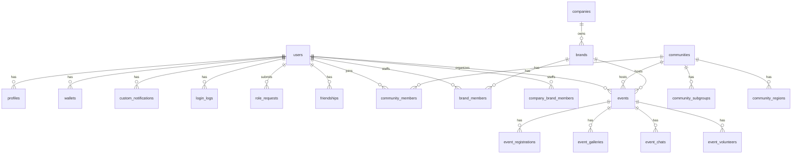

# 21 — ERD (textual)

Format: `Table (PK, FK→other.FK, columns…)`

```
users (id, name, username, email, password, status, banned_at, last_login_at, last_login_ip, deleted_at, created_at, updated_at)
  └─ profiles (id, user_id→users.id, display_name, bio, photo_path, phone, address, privacy, …)
  └─ login_logs (id, user_id→users.id nullable, ip_address, user_agent, success, created_at)
  └─ audit_logs (id, actor_id→users.id, action, target_type, target_id, before JSON, after JSON, ip, ua, created_at)
  └─ role_requests (id, user_id→users.id, requested_role, status, reason, decided_by→users.id, decided_at)
  └─ friendships (id, user_id, friend_id, status, created_at)
  └─ friend_blocks (id, user_id, blocked_id, created_at)
  └─ wallets (id, user_id→users.id unique, balance, currency, created_at)
  └─ wallet_transactions (id, wallet_id→wallets.id, type, amount, ref_type, ref_id, created_at)
  └─ member_galleries (id, user_id, file_path, caption, created_at)
  └─ member_histories (id, user_id, type, ref_type, ref_id, created_at)
  └─ custom_notifications (id, user_id, type, title, body, read_at, created_at)
  └─ translations (id, locale, key, value, created_at)

communities (id, owner_id→users.id, name, slug, description, category_id→community_categories.id, status, membership_mode, region, logo_path, …)
  └─ community_members (id, community_id, user_id, internal_role, joined_at, left_at, banned_at)
  └─ community_member_roles (id, community_id, user_id, role, period_start, period_end)
  └─ community_subgroups (id, community_id, name, description, created_at)
  └─ community_regions (id, community_id, region_id→regions.id, name)
  └─ community_bookmarks (id, user_id, community_id, created_at)
  └─ community_bans (id, community_id, user_id, reason, created_at)
  └─ community_internal_roles (id, community_id, name, permissions JSON)
  └─ community_managements (id, community_id, user_id, period_start, period_end)
  └─ community_volunteers (id, community_id, user_id, period_start, period_end, status)
  └─ community_ownership_transfers (id, community_id, from_user_id, to_user_id, status, created_at)
  └─ community_campaigns (id, community_id, title, description, status)
  └─ community_campaign_applications (id, community_campaign_id, brand_id, status, created_at)

events (id, organizer_type, organizer_id, title, description, event_type, visibility, status, start_at, end_at, capacity, registration_cutoff, registration_fee, requires_payment, accepts_donation, info_only)
  └─ event_registrations (id, event_id, user_id nullable, status, presence_status, created_at)
  └─ event_payment_confirmations (id, event_registration_id, amount, method, status, created_at)
  └─ event_galleries (id, event_id, file_path, caption, uploader_id, created_at)
  └─ event_chats (id, event_id, user_id, body, created_at)
  └─ event_chat_threads (id, event_chat_id, user_id, body, created_at)
  └─ event_volunteer_campaigns (id, event_id, title, slots, status)
  └─ event_volunteer_applications (id, campaign_id, user_id, status, created_at)
  └─ event_volunteers (id, event_id, user_id, role, period_start, period_end)
  └─ event_donations (id, event_id, user_id, amount, message, created_at)
  └─ event_finance_transactions (id, event_id, type, amount, ref, created_at)
  └─ event_finance_summaries (id, event_id, gross, fee, net, created_at)

brands (id, owner_id→users.id, company_id→companies.id nullable, name, slug, industry, status, logo_path, …)
  └─ brand_members (id, brand_id, user_id, role, status, period_start, period_end)
  └─ brand_ownership_transfers (id, brand_id, from_user_id, to_user_id, status, created_at)
  └─ company_brand_members (id, company_id, brand_id, status, created_at)

companies (id, owner_id→users.id, name, slug, industry, status, logo_path, …)

campaigns (id, owner_type, owner_id, type, title, description, status, budget, start_at, end_at)

collaboration_requests (id, requester_type, requester_id, target_type, target_id, status, terms, created_at)
collaboration_proposals (id, requester_type, requester_id, target_type, target_id, context_type, context_id, status, terms, created_at)

donations (id, donor_id, recipient_type, recipient_id, amount, message, status, created_at)
platform_fees (id, ref_type, ref_id, type, percent, fixed, currency, created_at)

cms_pages (id, slug, title, body, status, created_at)
blogs (id, slug, title, body, author_id, status, published_at, created_at)
homepage_sections (id, key, title, body, position, status)
contact_settings (id, recipient_email, auto_reply, updated_at)
suggestions (id, user_id nullable, name, email, body, status, created_at)

admin_conversations (id, title, created_by, created_at)
admin_conversation_participants (id, conversation_id, user_id, role, created_at)
admin_messages (id, conversation_id, sender_id, body, created_at)

premium_plans (id, name, price, duration_days, features JSON, status)
subscriptions (id, user_id, plan_id, starts_at, ends_at, status)
feature_locks (id, feature_key, plan_required, status)
feature_usages (id, user_id, feature_key, period, count, created_at)

exports (id, user_id, type, params JSON, status, file_path, created_at)
approval_logs (id, approver_id, target_type, target_id, action, reason, created_at)
audit_logs (see users)

master: regions, community_categories, interests, event_types, collaboration_types, payment_methods, industries, product_categories, campaign_types, csr_categories, company_types, brand_types, employee_positions, payment_statuses, approval_statuses, content_statuses, chat_room_types, event_statuses, role_requests.status enum, users.status enum, communities.status enum, brands.status enum, companies.status enum, events.status enum, collaboration_proposals.status enum, donations.status enum, subscriptions.status enum, premium_plans.status enum, role_requests.status enum.

spatie tables: roles, permissions, model_has_roles, model_has_permissions, role_has_permissions.
```

## Diagram (Mermaid)

